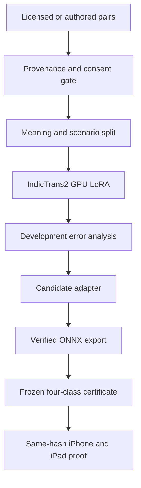

# English ↔ Nepali: local GPU training architecture

**Hardware:** Ryzen 9 7900X, 64 GB RAM, RTX 4070 Ti SUPER (16 GB). **Product:** offline iPhone/iPad translation using the IndicTrans2 dist-200M directional checkpoints. **Status:** a trained adapter is an experiment; the app still runs the pinned base INT8 ONNX bundles until a new export passes the exact four-class certificate and device tests.

**Repository basis:** inspected the accessible `974f7c0` checkout. The later `cursor/v1-complete-build` branch was unavailable here; recheck all file paths and recent changes there before implementing this specification. Preserve the unrelated modified `mobile/assets/android-icon-foreground.png`.

## Recommendation

Run three tracks in order:

1. **Diagnose the existing model and app decode path.** Compare the same inputs in HF PyTorch FP32/BF16, pinned ONNX INT8, and the phone; isolate generation, tokenization, register, Roman normalization, and quantization losses before training.
2. **GPU LoRA as an experiment.** Start from the two original HF IndicTrans2 dist-200M checkpoints, not the quantized ONNX exports. Train one adapter per directional checkpoint on the existing curated mix. Compare no-adapter, current 164-meaning adapter, and improved-data adapter on a separate development set.
3. **Buy quality with data.** Add 2,000–5,000 independently authored or reviewed product-domain *meanings* before scaling epochs. Ask bilingual reviewers to fix semantics, honorifics, idiom, morphology, and Roman input. Let open models propose alternatives; never promote model output without review.

The current ~1,544 EN→NE and ~1,352 NE→EN training rows contain repeated examples from only 164 meanings. More passes over the same meanings cannot provide broad coverage. Keep a clean held-out split by meaning, scenario, and paraphrase family; count unique reviewed meanings, not rows after upsampling.

## What the current code actually does

| Component | Finding | Change |
| --- | --- | --- |
| `training/finetune_it2_cpu.py` | Explicit `use_cpu=True`, `torch.float32`, `bf16=False`, `dataloader_num_workers=0`; the 4070 Ti SUPER will not be used. | Create `training/finetune_it2_gpu.py` or add a tested `--device cuda` branch. Keep the CPU script intact for reproducibility. |
| `training/prepare_cpu_mix.py` | Splits by `meaning_id` before 4×/8× upsampling, which prevents exact meaning leakage into validation. Some register variants are produced by string replacement; priority Roman examples are fed directly to the Devanagari checkpoint. | Preserve the grouped split, audit generated morphology with a bilingual reviewer, and make Roman→Devanagari normalization match production before NE→EN training/eval. |
| `training/local_auto_train.py` and `route_corrections.py` | A threshold of 100 edited meanings triggers the CPU script and directly updates the meaning bank. **There is a concrete break:** the router labels edits `human_meaning_review`, but `prepare_cpu_mix.py` does not include that value in `KEEP_PROVENANCE`; it drops those rows and rewrites the bank. The auto trainer can then reset its edited counter without having trained on the edits. | Repair and test this data-loss path before importing edits: candidate queue → consent/rights/quality approval → approved provenance → versioned dataset → GPU run. Keep public Today's 10 submissions separate from approved training data. |
| `mobile/src/mt/onnx/it2-release-manifest.json` | Pins multiple weights and tokenizer files per direction. | Record all base, adapter, tokenizer, export, quantized, and binary hashes; never describe two model hashes as the whole artifact. |
| `benchmarks/ship_thresholds.json` | Four immutable release gates: formal EN→NE 0.55, informal EN→NE 0.50, Devanagari NE→EN 0.55, Roman NE→EN 0.40, plus register rules. | Keep gold and floors frozen. The last recorded EN→NE scores were 0.4468/0.4440; a phrasebook win is not a ship PASS. |

## Architecture



### Dataset record

Store one canonical meaning with variants and provenance; materialize directional examples **after** splitting. A record should include `meaning_id`, `scenario_id`, `english`, `ne_formal`, `ne_informal`, optional human-attested `roman_*`, `source_uri`, `license`, `rights_status`, `reviewer_id`, `review_status`, `source_hash`, `target_hashes`, `consent_version` for contributor data, and `split`. Keep raw contribution media outside this table.

Use `train` / `dev` / `untouched_test` by **scenario or meaning family**, rather than random rows. Hold out alternate paraphrases, English and Nepali variants, and Roman/Devanagari forms of one meaning together. Before writing a train file, reject exact normalized source or target matches against the frozen gold and FLORES blocklists, public review exposures on **both sides**, and near duplicates flagged for review. A string hash alone does not catch paraphrase leakage; run embedding/character-similarity searches and inspect close hits. Keep dataset manifests and a row-level exclusion reason.

### GPU training recipe: first defensible experiment

| Knob | Initial value | Sweep after baseline |
| --- | --- | --- |
| Base | `ai4bharat/indictrans2-en-indic-dist-200M` and `ai4bharat/indictrans2-indic-en-dist-200M`, immutable revisions | Do not train from ONNX INT8 |
| Precision | BF16 if PyTorch reports support; otherwise FP16 with loss scaling | FP32 diagnostic on a few cases |
| LoRA | rank 16, alpha 32, dropout 0.05, `q_proj,v_proj` | rank 8/32; then attention/output/FFN targets only if justified |
| Sequence | source/target 96 tokens, measured truncation count | 128 for longer camera sentences |
| Batch | microbatch 8, accumulation 4, effective batch 32 | Reduce microbatch to 4/2 on OOM, keep effective batch near 32 |
| Schedule | LR 1e-4, warmup 5%, weight decay 0.01, 2–4 epochs | 5e-5 and 2e-4; stop on dev generation metric |
| Evaluation | Generate on a separate in-domain dev set every epoch; save best checkpoint | Three seeds for the finalist |
| Machine | CUDA, 2–4 data workers, pinned memory, deterministic seed and full log | Measure VRAM, steps/s, truncation, loss, chrF by class |

These are **starting settings**, not proven optimum or runtime estimates. A 200M LoRA does not require 4-bit QLoRA on 16 GB; first use the regular BF16 base. If CUDA fails, verify the installed PyTorch wheel and driver before changing model/data code. Native Windows CUDA can work; WSL2 is an alternative when package compatibility is troublesome. Follow the current [PyTorch installer](https://pytorch.org/get-started/locally/) for the chosen environment and check `torch.cuda.is_available()`, device name, BF16 support, and a short forward/backward pass. NVIDIA documents CUDA support in [WSL2](https://docs.nvidia.com/cuda/wsl-user-guide/index.html).

Create a new script with these explicit assertions, rather than simply removing `use_cpu=True` from the CPU job:

```python
assert torch.cuda.is_available(), "GPU run must not fall back to CPU"
assert dataset_manifest["gold_overlap"] == 0
assert dataset_manifest["unapproved_rows"] == 0
dtype = torch.bfloat16 if torch.cuda.is_bf16_supported() else torch.float16
model = AutoModelForSeq2SeqLM.from_pretrained(
    pinned_base_path, trust_remote_code=True, torch_dtype=dtype
).to("cuda")
# Attach PEFT SEQ_2_SEQ_LM LoRA, validate target modules and trainable parameter count.
# Use Seq2SeqTrainingArguments(use_cpu=False, bf16=(dtype==torch.bfloat16),
#   fp16=(dtype==torch.float16), gradient_accumulation_steps=4, ...)
# Produce a unique run directory; never overwrite a previous adapter or split.
```

Pin compatible `torch`, `transformers`, `peft`, `datasets`, `IndicTransToolkit`, and tokenizer revisions in a dedicated environment; capture `pip freeze`, GPU/driver details, input hashes, seed, precision, wall time, and peak allocated VRAM in `run_manifest.json`. The repository's existing training scripts are a starting point, not proof of a working GPU or export path. PEFT supports LoRA without retraining all base parameters. [PEFT documentation](https://huggingface.co/docs/peft/main/conceptual_guides/lora).

### Experiments worth running

| Run | Change | Question |
| --- | --- | --- |
| E0 | Base HF vs pinned ONNX on identical inputs | Is EN→NE failure already present in the base, introduced in export/INT8, or caused by app decode? |
| E1 | GPU version of today's 164 meanings, exact existing split | Can the current data improve unseen meanings at all? |
| E2 | E1 with reviewer-corrected formal/informal variants and balanced 1–4× sampling | Are mechanical honorific transformations or 8× repetitions harming generalization? |
| E3 | E2 plus 2k–5k reviewed conversation meanings | Does novel in-domain data improve both EN→NE classes without breaking NE→EN? |
| E4 | Compare register prefix versus inference-only register rule on **the same** split | Does the model learn style or just copy a prefix? Check pronouns, verb agreement, and absence of `तँ`. |
| E5 | Original Roman→Devanagari→NE→EN path versus direct Roman fine-tune | Only keep a direct Roman path if it improves unseen noisy Roman inputs and is shippable. |

Choose by unseen-development chrF, human adequacy/style scores, and error buckets; run the frozen gold certificate on shortlisted candidates, then a new blind post-selection set. Repeated gold-driven hyperparameter tuning would erode its independence. Keep source preserving examples for questions, negation, names/numbers, politeness, travel/health, OCR fragments, long sentences, and code-switching.

## Specific data options

**Priority** is based on product fit and attainable review quality. A public dataset's package license does not automatically clear every underlying document, and a bilingual-looking page is not automatically a good sentence pair. Record a source manifest and provenance per row before import.

| Source | What to gather | Product fit / use | Rights and quality gate |
| --- | --- | --- | --- |
| Commissioned bilingual Nepali reviewers | 2k–5k original traveler, family, transport, health, restaurant, directions, consented camera-label meanings; formal/informal plus noisy Roman variants | **Highest priority**: directly targets failures and creates owned training + blind test material | Written assignment/permission; separate authors of train and test; double review high-risk health language |
| Existing `meaning_bank.jsonl` + traveler seeds | Correct and expand 164 meanings with minimal pairs for pronoun/verb agreement, negation and number | Seed curriculum and regression suite | Verify source rights and mechanical variants; avoid counting paraphrases as independent meanings |
| [BPCC-H-Daily, Nepali](https://huggingface.co/datasets/ai4bharat/BPCC/tree/main/daily) | Sample short everyday `npi_Deva` pairs | Strong candidate for expansion, not a bulk import | Dataset card lists newly added daily/seed as CC BY 4.0; verify file provenance and attribution, review Nepali register |
| [BPCC-Seed, EN–Nepali](https://huggingface.co/datasets/ai4bharat/BPCC/tree/main/bpcc-seed-v1) | Short human pairs from `eng_Latn-npi_Deva`; inspect current/latest release | Useful broader paraphrases | Check subset-specific terms, duplicates and domain; keep exact source/version |
| [Tatoeba EN–Nepali](https://tatoeba.org/en/downloads) | Short linked, complete sentences and alternate translations | Good candidate for small, hand-reviewed traveler slice | Check each row's license/attribution and translation quality; default text license is CC BY 2.0 FR |
| Consented in-app Meaning Review | Contributor-proposed edits to existing meanings, not automatic public-review output | Valuable continuous correction signal | Current consent, rights, deletion/exposure status, bilingual review, versioned approval; never train merely because 100 edits arrived |
| Original on-site signage/labels | Commissioned transcription and translations for transport, shop, office and safety phrases | Valuable for Camera short-text mode | Use owned/permission-cleared text and imagery; keep image rights separate from text and pair quality |
| [Wikidata labels/aliases](https://www.wikidata.org/wiki/Wikidata:Licensing) | Named entities and bilingual terms | Lexicon and copy/normalization tests, not sentence MT bulk | CC0 for Wikidata structured data; validate names, dialect, transliteration |
| [BPCC-Mined](https://huggingface.co/datasets/ai4bharat/BPCC) | Small, sampled, domain-filtered slice only after strong quality filter | Candidate for diversity if E3 plateaus | AI4Bharat's packaging statement distinguishes CC0 mined from CC BY human subsets; audit upstream lineage and remove noisy alignments |
| Government/site labels already in `training/` | 60 short labels and additional permission-cleared equivalents | Camera labels and service navigation | Source rights unresolved unless documented; avoid using government text as a substitute for everyday speech |
| Independently authored English or Nepali prompts + human translation | Target error buckets and long-tail vocabulary | Safest synthetic *source* of new product meanings | Keep model suggestions as unapproved alternatives until a bilingual reviewer writes/accepts final pairs |

**Evaluation-only:** `benchmarks/gold/`, FLORES, and a fresh blind human set; never feed any of their sentences, paraphrases, or reference translations into training or teacher prompts. [FLORES card](https://huggingface.co/datasets/facebook/flores). Keep OPUS-100 software UI, Global Voices news, and Titung Bible/KDE/legal out, as the project already decided. OpenSubtitles, broad web scrapes, and machine-mined news are low-priority for this app and need separate quality/rights work.

AI4Bharat describes the IndicTrans2 model checkpoints as MIT and publishes BPCC with subset-specific rights; confirm those at the pinned revisions before commercial use. [IndicTrans2 repository](https://github.com/AI4Bharat/IndicTrans2) · [BPCC dataset card](https://huggingface.co/datasets/ai4bharat/BPCC) · [Tatoeba reuse guidance](https://en.wiki.tatoeba.org/articles/show/using-the-tatoeba-corpus).

## Better models for proposing corrections

These models run on the **PC for candidate generation/comparison**, not in the app. Benchmark each on 100 newly authored bilingual examples scored by two Nepali speakers before paying for a large labeling job. Ask for semantic correctness, appropriate `तपाईं`/`तिमी` verb forms, idiom, named entities, and hallucination; preserve the original and all candidates for audit.

| Candidate | Why try it | 16 GB plan / limit |
| --- | --- | --- |
| [TranslateGemma 4B](https://huggingface.co/google/translategemma-4b-it) | Translation-specialized multilingual teacher; compare to current IndicTrans2 | Run quantized or low-memory inference with the model's required chat template and language codes; verify Nepali support and Google usage terms. |
| [TranslateGemma 12B](https://huggingface.co/google/translategemma-12b-it) | Stronger translation candidate | Quantized single-job inference may fit but leaves less headroom and is slower; verify actual VRAM and template. Not the first teacher to set up. |
| [IndicTrans2 1B EN–Indic / Indic–EN](https://github.com/AI4Bharat/IndicTrans2) | Same ecosystem and preprocessing, useful independent-size comparison | HF BF16 or quantized inference; check meaningfully different errors versus 200M before paying review effort. |
| [Qwen3 8B](https://huggingface.co/Qwen/Qwen3-8B) | Multilingual instruction model for **error explanation and alternative phrasings**; Apache 2.0 model card | Quantized inference on the PC; Nepali accuracy must be measured. Its suggestions are not ground truth. |
| [NLLB-200 distilled 600M](https://huggingface.co/facebook/nllb-200-distilled-600M) | Research-only comparison on permitted evaluation inputs | CC BY-NC model; exclude from commercial student training/candidate pipeline pending explicit rights clearance. |

For each owned English prompt: collect two candidate Nepali translations independently, compare to base output, select a reviewer-approved meaning and formal/informal forms, and add it to the next **versioned** training set. For Nepali→English, use originally authored Nepali prompts as well, to avoid creating only translationese in that direction. Do not ask a teacher to see private gold references or user media.

## Export and acceptance

1. Validate an adapter with the HF model on unseen dev meanings. Record the exact base revision and adapter hash. The repository explicitly warns that generic `merge_and_unload` has corrupted this IndicTrans2 path; do not silently use it.
2. Implement a separate, tested fusion/export route on a **copy** of the base checkpoint. Compare HF base+adapter to fused HF on a fixed multilingual fixture: token IDs, generated outputs, register, numerical entities, and beam settings. If fusion differs materially, stop at an adapter experiment.
3. Export ONNX and quantize. Check HF adapter ↔ ONNX FP32 ↔ ONNX INT8 output parity and class scores; note the upstream INT8 variant has differences from FP32, so budget for quantization regressions. Hash every output weight, sidecar, tokenizer and generation file; pin a new manifest. [Current ONNX exporter/model card](https://huggingface.co/hari31416/indictrans2-en-indic-dist-200M-ONNX-int8).
4. Run `python benchmarks/certify_ship_artifacts.py --require-weights` against exactly those pinned files. Preserve `benchmarks/gold/`, thresholds, and previous certificates. Four class floors **and** register rates must pass. Then test the same hashes in a real iPhone and iPad airplane-mode build, including long text, Roman inputs, memory/latency and thermal behavior.
5. Only promote after an exact-SHA requirement ledger and device evidence. A new adapter alone does not change the app. If no safe export path passes parity, keep base INT8 and improve the pre/postprocessing and owned phrase/lexicon overlay while continuing research.

## First practical week

1. On the owner's Windows PC, check CUDA and copy this plan onto `cursor/v1-complete-build` without overwriting work. **Back up the meaning bank before running `prepare_cpu_mix.py`; it rewrites that file and currently drops `human_meaning_review` edits.** Fix that route with an approved-provenance fixture and a test that a reviewed edit survives prep and reaches the train file. Save a snapshot of current data, manifest, split IDs, model revisions, and release certificate. Do not change gold or thresholds.
2. Add a GPU trainer that fails if CUDA is absent; run 20 steps on 20 **training** examples and one dev batch. Confirm numerical stability, target-token preprocessing, VRAM, adapter save/reload, and generated text.
3. Run E0 and E1 with the frozen existing dataset. Inspect at least 40 EN→NE failures and 20 Roman failures; tag the cause (wrong meaning, register, quantization, Roman normalizer, missing context, domain gap).
4. Commission 100–200 new bilingual pairs across the worst buckets and pilot the BPCC-H-Daily/Tatoeba review workflow. Do not use frozen gold for annotation. Run E2/E3 when enough reviewed meanings exist.
5. Select a finalist on dev/human scores, attempt export parity, and run exact-weight certification. If the model still misses a floor, report the failure and choose the next data or decode experiment; leave public V1 NO-GO.
